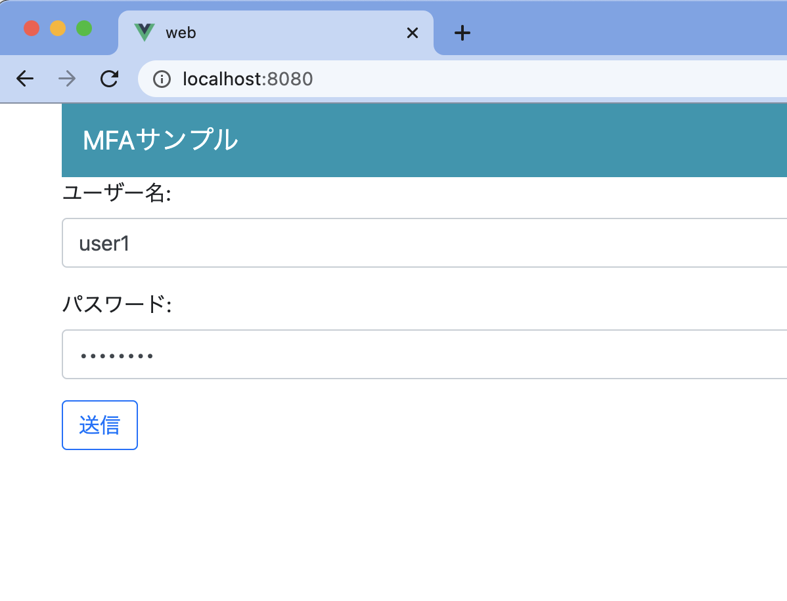
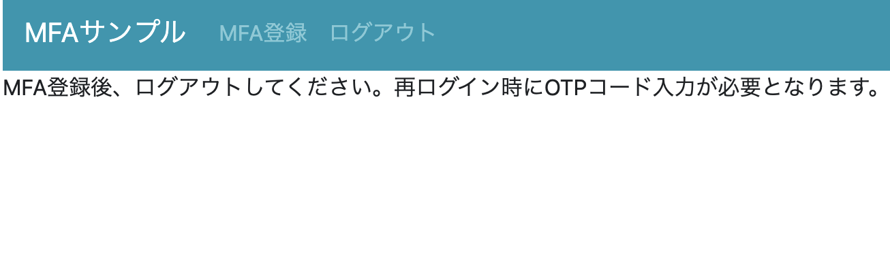
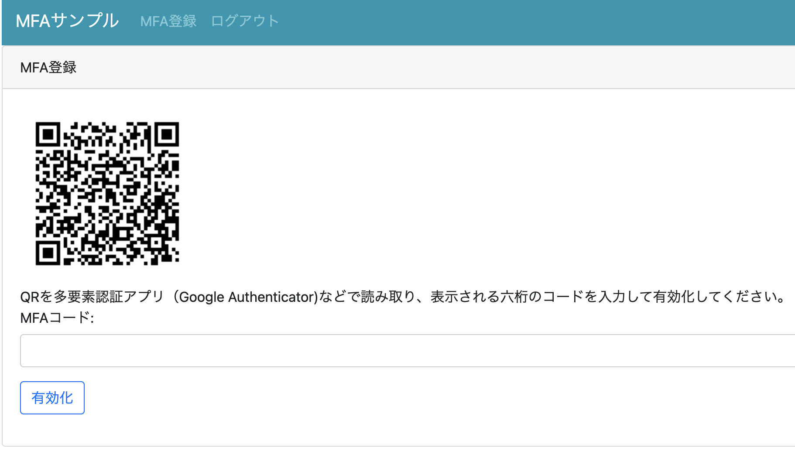
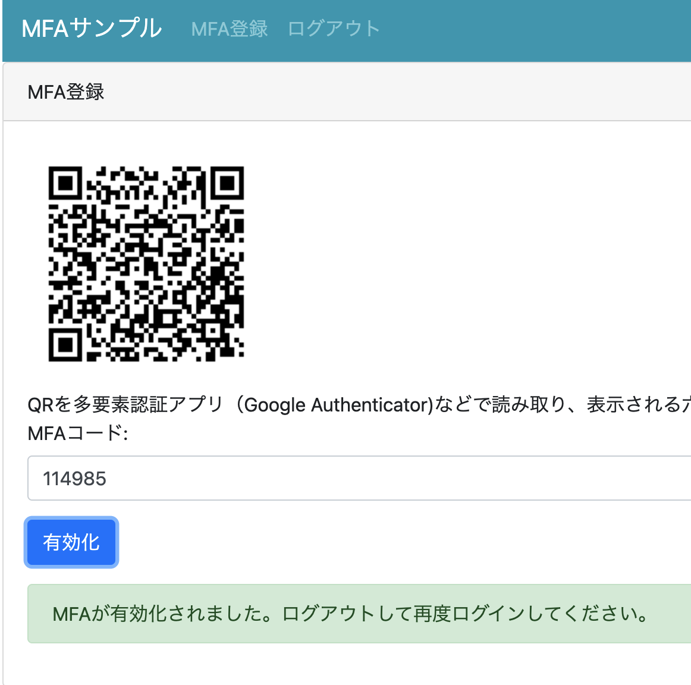
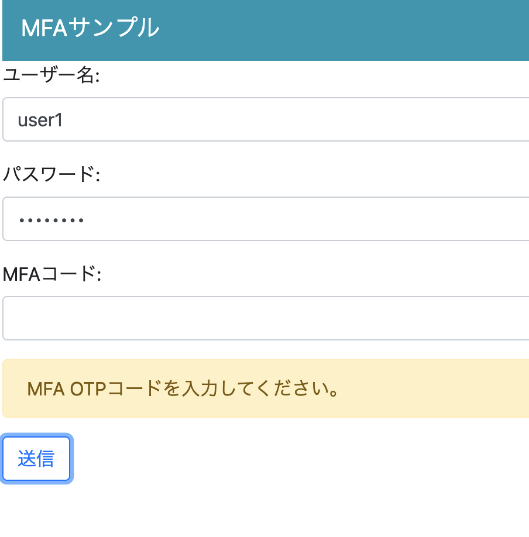

#初期設定
##Javaのインストール
Java8以降のJDKをインストールします。

##npmのインストール
画面側の生成にnpmを使用するため、Node.jsをインストールします。

- https://nodejs.org/en/

##(option)Eclipseのプロジェクトセット生成
Eclipseを使用する場合は、プロジェクトセットを生成できます。

```
gradlew.bat cleanEclipse eclipse
```

生成後、Eclipseのインポートメニューでインポートできます。

##実行
以下のコマンドでサーバが実行されます。実行後、 http://localhost:8080にアクセスするとログイン画面にアクセスできます。

```
gradlew.bat bootRun
```

##サンプルの実行フロー

ログイン画面
```
ユーザー名 : user1 
パスワード : password 
```

でログインできます



ヘッダーの「MFA登録」をクリックします。



MFA設定用のQRコードが表示されます。Google Authenticatorなどの多要素認証アプリで読み込みます。




MFAを有効化するために、アプリに表示されたOTPのコードを入力し、有効化ボタンを押します。



有効化後は、ログイン時にOTPコードが必要となります。確認のためにヘッダーのログアウトボタンを押します。

再度ログインを行います。ID/パスワードの入力後に送信すると、MTAのコードを要求されます。正しいコードを入れると、ログインができるようになります。




#開発
##画面の開発
Vueの開発を行う場合、以下のコマンドでローカルサーバを起動します。

```
cd web
npm run serve
```

起動後、http://localhost:8081 にアクセスすると画面が表示されます

##サーバ側の開発
mfasample.MFASampleApplication クラスがMainクラスになります。このクラスを起動してください。

